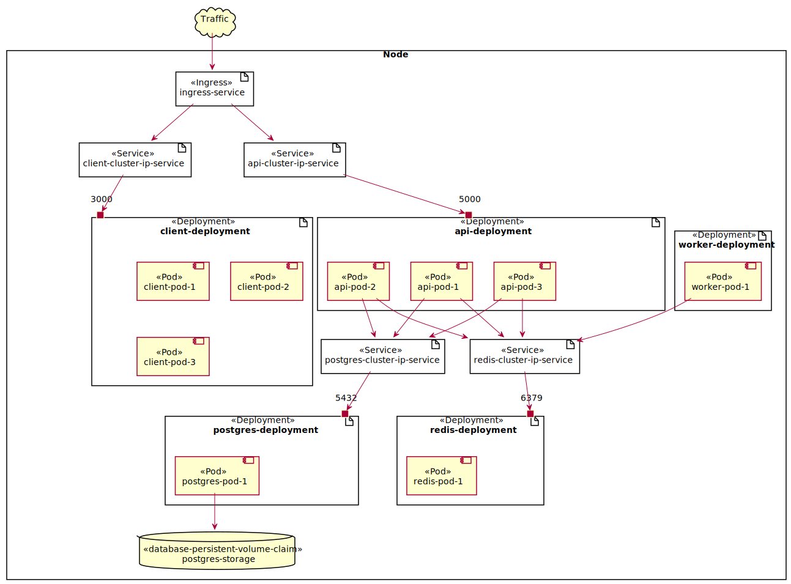

# Table Of Contents

1. [Kubernetes Dashboard](#kubernetes-dashboard)
2. [Secrets](#secrets)
3. [Ingress Nginx](#ingress-nginx)

# Deployment Diagram



# Kubernetes Dashboard

## Configuration

* [Deploy and Access the Kubernetes Dashboard](https://kubernetes.io/docs/tasks/access-application-cluster/web-ui-dashboard/)

```shell
kubectl apply -f https://raw.githubusercontent.com/kubernetes/dashboard/v2.6.1/aio/deploy/recommended.yaml
kubectl apply -f k8s-dashboard
```

## Access Token

```shell
kubectl -n kubernetes-dashboard create token admin-user
```
# Secrets

We don't want to have secrets in configuration files, so we will create these in an imperative way.

```shell
kubectl create secret generic complex-pg-credentials \
 --from-literal PG_USER=..... \
 --from-literal PG_PASSWORD=.....
```

# Ingress Nginx

* [Studying the Kubernetes Ingress system](https://www.joyfulbikeshedding.com/blog/2018-03-26-studying-the-kubernetes-ingress-system.html)
* [Kubernetes Documentation /../ Ingress](https://kubernetes.io/docs/concepts/services-networking/ingress/)

```shell
brew install helm
```

```shell
helm upgrade --install ingress-nginx ingress-nginx \
  --repo https://kubernetes.github.io/ingress-nginx \
  --namespace ingress-nginx --create-namespace
```

# Google Cloud

## Pricing Calculator

* [Google Cloud Pricing Calculator](https://cloud.google.com/products/calculator)